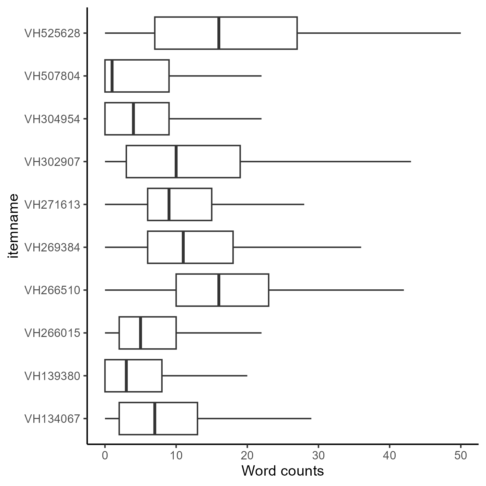

## Data File Information

Data for the competition has been aggregated into a single file from
multiple test items. For this challenge you will be using items from the
grade 4 and grade 8 NAEP Math Assessments that were administered in 2017
and 2019. Information about the aggregated file and how it was prepared,
along with general instructions for the challenge and data handling
rules are contained below. Questions about the challenge should be
posted to the Github "issues" page for the challenge:
<https://github.com/naep-as-challenge>

## Variables Common to All Items

Some variables about the item, responses, and respondent were available
for all items in the source data. Those variables are described in the
table below.

| Variable         | Description                                                                                             | Type    | Values (if constrained)                                                                                                                                                               |
|:-----------------|:--------------------------------------------------------------------------------------------------------|:--------|:--------------------------------------------------------------------------------------------------------------------------------------------------------------------------------------|
| student_id       | pseudonymous student ID -- not linkable across item-years                                               | string  | e.g. "xYzq4StVaC"                                                                                                                                                                     |
| accession        | Item number                                                                                             | string  | e.g. "VH139087"                                                                                                                                                                       |
| score_to_predict | Outcome to predict                                                                                      | integer | e.g. 1, 2, 3                                                                                                                                                                          |
| predict_from     | Text related to "score_to_predict"                                                                      | string  | "Because A\>B"                                                                                                                                                                        |
| year             | Year assessment was administered                                                                        | integer | 2017, or 2019                                                                                                                                                                         |
| srace10          | Student's race reported by the school                                                                   | string  | (1='White, not Hispanic', 2='Afric Amer, not Hisp', 3='Hispanic of any race', 4='Asian, not Hispanic', 5='Amer Ind/Alaska Nat', 6='Native Ha/Pac Island', 7='\>1 race, not Hispanic') |
| dsex             | Student's sex                                                                                           | integer | 1=male, 2=female                                                                                                                                                                      |
| accom2           | Student accommodations. Note: Item VH304954 did not have accom2 so for this item accom2 is entirely NA. | integer | 1='Accommodated', 2='Not accommodated'                                                                                                                                                |
| iep              | IEP                                                                                                     | integer | 1=SD, 2=Not SD                                                                                                                                                                        |
| lep              | English learner status                                                                                  | integer | 1=English Learner, 2=Not English Learner                                                                                                                                              |
| rater_1          | Score given by human rater (Type I items only)                                                          | string  | e.g. 1A, 2B, 3A …                                                                                                                                                                     |
| pta_rtr1         | Part A human rater score (Type II items only)                                                           | string  | e.g. 1, 2A, 2, 3A …                                                                                                                                                                   |
| ptb_rtr1         | Part B human rater score (Type II items only)                                                           | string  | e.g. 1, 2A, 2, 3A …                                                                                                                                                                   |
| ptc_rtr1         | Part C human rater score (Type II items only)                                                           | string  | e.g. 1, 2A, 2, 3A …                                                                                                                                                                   |
| composite        | Composite score (Type II items only)                                                                    | integer | e.g. 1, 2, 3                                                                                                                                                                          |
| score            | Score (containing partial credit codes)                                                                 | string  | e.g. 1A, 2B, 3A …                                                                                                                                                                     |
| assigned_score   | Simplified numeric score total for item (1, 2, 3...) from either "rater_1" or "composite"               | integer | 1, 2, 3 …                                                                                                                                                                             |
| ee_use           | Item used equation editor                                                                               | integer | 0=no EE use, 1=EE use                                                                                                                                                                 |

## Data Processing Information

We have classified the 10 items into Type I and Type II for the purpose of automated scoring; please note that these are categories created only for the purpose of this challenge for the sake of clarity in this automated scoring context.

There are six Type I items which are composed of multiple parts that each have a score and response fields. For the purpose of the challenge, participants are requested to score one part of the item which contains a section that is potentially scorable using NLP. For the four other items, called Type II items here, there are multiple parts within an item; however, these parts are dependently linked portions of the item and, as such, were assigned a single score that encompasses the responses contained within two or more parts.

For the Type II items, the sub-item scores have been combined into a single "assigned_score" variable which is described in the common variables table above. The original part scores are also included and can be decoded using the item scoring guides provided in "Item information.zip".

To make it clear which outcome contestants should predict, we've created a variable "score_to_predict" which is the field which will be used as the outcome variable to create predicted scores for. We've also created a variable named "predict_from" to identify the text with the most relevant constructed response text to use when creating predicted scores, although as noted, some scores include more than just the text in the scoring decision. Participants are encouraged to use all item parts in their scoring model to improve performance.

## Variables with different meanings for each item

Please consult the scoring guides included in `Item information.zip` to map the fields below
to the question areas.

#### For item VH134067

**parsed_xml_v1**-- Text for ECR item response.    

#### For item VH139380

**parsed_xml_v1**-- SCR text  \
**parsed_xml_v2**-- ECR text    

#### For item VH266015

**source1**-- drag and drop tile "from"  \
**source2**-- drag and drop tile "from"  \
**source3**-- drag and drop tile "from"  \
**source4**-- drag and drop tile "from"  \
**target1**-- drag and drop tile "to"  \
**target2**-- drag and drop tile "to"  \
**target3**-- drag and drop tile "to"  \
**target4**-- drag and drop tile "to"  \
**parsed_xml_v1**-- CR text    

#### For item VH266510

**parsed_xml_v1**-- ECR text  \
**selected**-- MC radio button choices as a logical vector (e.g. "FALSE
FALSE TRUE FALSE") for 2019 only.  \
**eliminations**-- MC item eliminations as a variable length numeric
vector (e.g., c(1,3,4)) for 2017 only.  \
**eliminated**-- MC item eliminations as a length 4 logical vector
(e.g., TRUE FALSE FALSE TRUE) for 2019 only.    

#### For item VH269384

**selected1**-- 1st MC item option radio button 1  \
**selected2**-- 1st MC item option radio button 2  \
**selected3**-- 1st MC item option radio button 3  \
**selected4**-- 1st MC item option radio button 4  \
**selected1.1**-- 2nd MC item option radio button 1  \
**selected2.1**-- 2nd MC item option radio button 2  \
**eliminated1**-- 1st MC item elimination option radio button 1  \
**eliminated2**-- 1st MC item elimination option radio button 2  \
**eliminated3**-- 1st MC item elimination option radio button 3  \
**eliminated4**-- 1st MC item elimination option radio button 4  \
**eliminated1.1**-- 2nd MC item elimination option radio button 1  \
**eliminated2.1**-- 2nd MC item elimination option radio button 2  \
**parsed_xml_v1**-- ECR text    

#### For item VH271613

**partA_response_val**-- 1st MC item drop down menu selections as
numeric vector (e.g. c("1","1")) in 2017, and a fixed length logical
vector in 2019.  \
**partB_response_val**-- 2nd MC item radio button selections as vector
(e.g. c("1","")) in 2017, and a fixed length logical vector in 2019.
 \
**partB_eliminations**-- MC item eliminations for part B, format differs
by year.  \
**parsed_xml_v1**-- ECR text  \
*Note*-- For both the response values and the eliminations, the format
of the data changes between 2017 and 2019. In 2017, eliminations are
stored as list of numbers, perhaps in chronological order (e.g.,"1",
"2", but also "2--1" and "1--2"). In 2019 the responses and eliminations
are stored as fixed length logical vectors (e.g., "TRUE TRUE").  
 

#### For item VH302907

**parsed_xml_v1**-- ECR text  \
**parsed_xml_v2**-- CR text  \
**parsed_xml_v3**-- CR text    

#### For item VH304954

**parsed_xml_v1**-- CR text  \
**parsed_xml_v2**-- CR text    

#### For item VH507804

**source1**-- drag and drop tile "from"  \
**source2**-- drag and drop tile "from"  \
**source3**-- drag and drop tile "from"  \
**target1**-- drag and drop tile "to"  \
**target2**-- drag and drop tile "to"  \
**target3**-- drag and drop tile "to"  \
**parsed_xml_v1**-- CR text    

#### For item VH525628

**source1**-- drag and drop tile "from"  \
**source2**-- drag and drop tile "from"  \
**source3**-- drag and drop tile "from"  \
**source4**-- drag and drop tile "from"  \
**target1**-- drag and drop tile "to"  \
**target2**-- drag and drop tile "to"  \
**target3**-- drag and drop tile "to"  \
**target4**-- drag and drop tile "to"  \
**parsed_xml_v1**-- CR text  
 

## Information about constructed response field

The following plots provide information about the distribution of word counts found in the `predict_from` constructed response text, both including and excluding numbers and symbols.  \

