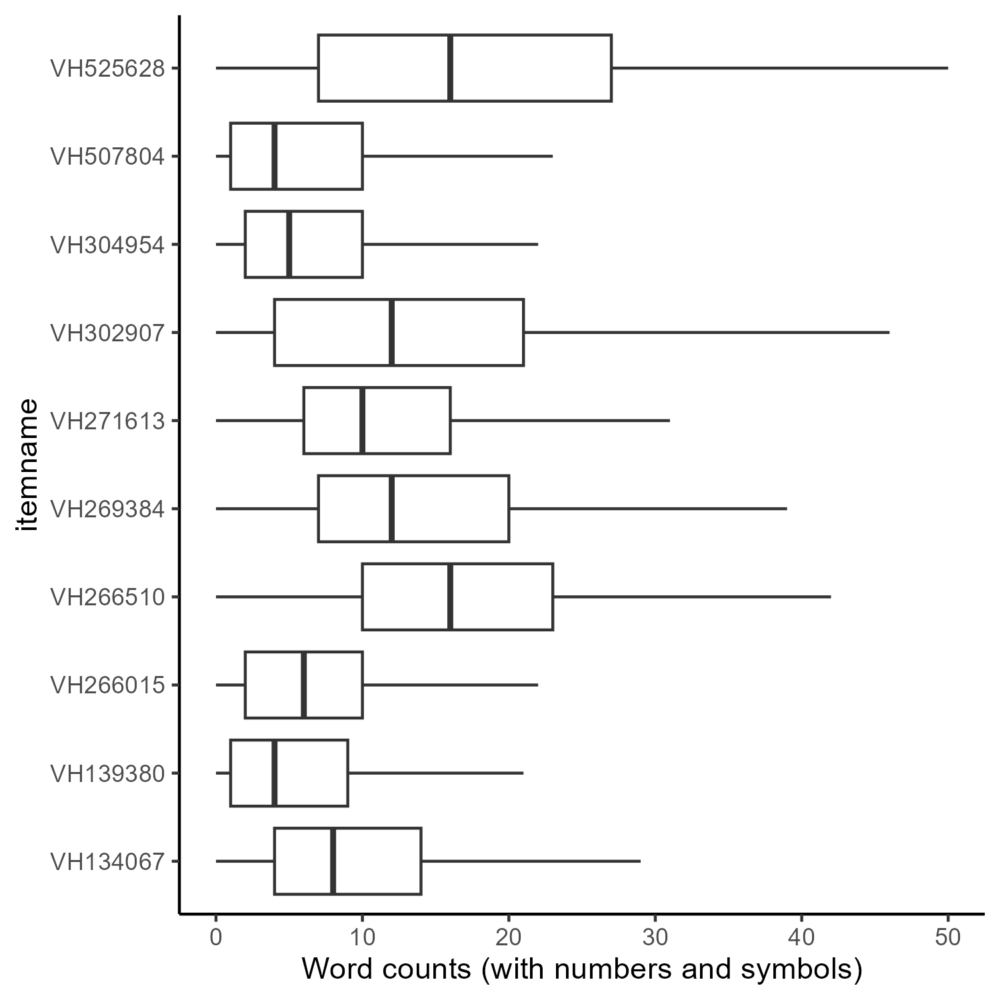

# Table of Contents

1. [Index](#index)
2. [Description](#description)
3. [Eligibility](#eligibility)
4. [Dataset](#dataset)
5. [Evaluation-Criteria](#evaluation)
6. [Participation-Process](#participation)
7. [Submission-Instructions](#submission)
8. [Prizes](#prizes)
9. [Timeline](#timeline)
10. [Appendix-A-Methods](#appendix)
11. [References](#references)

NAEP Math Automated Scoring Challenge Overview
================

The National Center for Education Statistics (NCES) is seeking
submissions of technical reports and predicted scores that apply natural
language processing algorithms to predict the human-assigned scores on
constructed response items for the National Assessment of Educational
Progress (NAEP) math assessment for students in fourth and eight grade.
The purpose of the challenge is to help NAEP to identify effective
approaches, expected levels of accuracy, and methods to ensure that
automated approaches do not demonstrate bias based on a student’s social
context or demographic factors. The Challenge requires that submissions
provide predicted human scores and are transparent in their submissions
by explaining the methods used to obtain those results. In addition to
the score prediction challenge, participants are invited to create
submissions for an “innovative interpretability challenge” that can help
explain algorithm functioning and provide evidence for the validity of
the algorithm in measuring student responses. Submission to the score
prediction challenge (and accuracy within top 10 entries) is required
for eligibility for the interpretability challenge.

## Challenge Details

Total Cash Prizes Offered: Maximum of \$40,000 for first-place
prediction entry, \$20,000 for first-place interpretability entry.

Type of Challenge: Automated Scoring of Mathematics  
Assessment Constructed Response Items using Natural Language Processing.

### Key Dates

| Milestone             | Date      |
|-----------------------|-----------|
| Challenge Opens       | 2/21/23   |
| Application Deadline  | 3/20/23   |
| Test Dataset Released | 5/1/23    |
| Submission Deadline   | 5/8/23    |
| Winners Announced     | June 2023 |

**An informational webinar will be held on March 7th 2023 @ 12:00 ET.
Attendance at the webinar is not required to participate in the
challenge.**

Advance webinar registration required at the following
[URL](https://www.eventbrite.com/e/rfi-for-naep-math-automated-scoring-challenge-tickets-529659705437).

## Challenge Administration Platform

The complete announcement and application to participate in the
Challenge is posted on
[Github](https://github.com/NAEP-AS-Challenge/math-prediction).

Specifically, this platform will be used for the following purposes:

1.  Information – detailed information about the challenge will be
    posted here and available to the public.

2.  Questions – all questions about the challenge, should be posted as
    an “issue” and will be publicly available. Responses will typically
    be made within 24 business hours.

**Please note that no data will be provided Github nor should any
submissions be posted via Github; this application is not authorized for
confidential data exchange by the Department of Education.**  
  
Instead, secure server information will be provided to approved
applications via the contact specified on the application. Challenge
data submissions will also be uploaded to this server.

Challenge Description
================

## Background

Automated Scoring using natural language processing (NLP) is a
well-developed application of artificial intelligence in education.
Results for predicting human assigned scores for essay items have been
demonstrated to be on-par with the inter-rater reliability of human
scorers for well-developed items (Shermis 2014). Currently, the National
Assessment of Educational Progress (NAEP) includes constructed
responses[^1] in approximately 50% of mathematics items to provide
students with an opportunity to explain their reasoning or the process
they used to respond to a mathematics item. Over 25% of these items can
be scored using automated rule-based methods, but others contain more
complex responses that cannot be accurately scored using these methods.
Currently, NAEP alliance members assemble teams of human scorers who
score millions of student responses to NAEP’s assessments.

In 2021 a [public data
challenge](https://github.com/NAEP-AS-Challenge/info/blob/main/results.md)
demonstrated that NAEP’s constructed response reading items can be
scored successfully with automated scoring, using natural language
processing. Prior internal special studies have also found that
automated scoring can perform as well as human raters in assigning
scores, and assigning a confidence level associated with the predicted
score.

The successful NLP approaches used in the prior challenge used large
language models, which contain billions of parameters. These advanced
machine learning algorithms are intrinsically difficult to understand by
human reviewers. The inability to understand how algorithms calculate
predictions makes it difficult to have confidence in the algorithm,
despite high degrees of accuracy (Doshi-Velez and Kim 2017). This
problem is not unique to education, and the definition of
interpretability, let alone consistent criteria to achieve it, have not
been established (Lipton 2018). As a result, this challenge provides an
opportunity and incentive for teams to conduct additional work in this
area.

In addition to increasing trust in prediction results, interpretability
can help provide additional information about patterns observed in
responses related to student math performance which can help provide
additional insights from assessment responses. Further, this information
may be helpful in developing assessment items that are focused on areas
of key issues.

## Current Challenge

This challenge seeks to expand on this earlier work to ascertain how
accurately automated scoring models can perform well with a
representative subset of NAEP math constructed response items
administered in 2017 and 2019 to students in grades 4 and 8. The
ultimate goal is to produce reliable and valid score assignments,
provide additional information about responses (e.g. common errors), and
generate scores more quickly while saving money on scoring costs.

A rubric and scoring guide is created for each item; therefore
successful respondents will be expected to build a predictive model for
each item, using current state-of-the-art practices in natural language
processing. As described more extensively in the “dataset” section, for
some items the constructed response portion of the item is scored in
isolation from other aspects of the response, and in other items there
is an overall score in which the predicted score will incorporate
results from calculations in addition to the constructed response.

Training data from prior human scoring administrations will be provided
for all items, in addition to detailed item guides providing the item
prompt and scoring criteria.

In addition to providing a set of predicted scores for these items,
successful respondents to this Challenge will provide a technical report
that describes the data pre-processing, model training, and model
performance information that was used to create the predicted scores.
Responses must include analyses to ensure that the predictions are not
systematically different from human-assigned scores by student social
context or demographic information; algorithm accuracy should be similar
for students from all backgrounds and not exhibit bias. NAEP student
information includes Race/ethnicity, sex/gender, English language
learner status, individualized education plans, and accommodations. More
information about each variable is provided in the *dataset* section.

The Federal Government is particularly interested in submissions that
provide accurate results and meet these objectives, as they have been
absent from a good deal of recent research in automated scoring,
particularly for solutions using artificial intelligence (e.g., neural
networks, transformer networks) and other complex algorithmic approaches
(Kumar and Boulanger 2020).

Both the technical report and predicted scores will be submitted
simultaneously. The report will be evaluated before respondents’
predicted score submissions are evaluated. Only reports that meet
acceptance criteria (as specified under “evaluation criteria”) will be
considered as valid submissions and evaluated for accuracy of the
predicted scores compared to the hold-out test dataset.

This process is consistent with the operational processes that the
Department intends to use in future applications of automated scoring
and artificial intelligence; only models that can provide substantive
validity evidence and demonstrate that bias is not observed would be
approved for production use. This aspect of the Challenge is of critical
importance to ensure that assessment solutions help us to promote equity
in education for students from all backgrounds and contexts.

Doshi-Velez, Finale, and Been Kim. 2017. “Towards A Rigorous Science of
Interpretable Machine Learning.” *arXiv:1702.08608 \[Cs, Stat\]*, March.
<http://arxiv.org/abs/1702.08608>.

Kumar, Vivekanandan, and David Boulanger. 2020. “Explainable Automated
Essay Scoring: Deep Learning Really Has Pedagogical Value.” *Frontiers
in Education* 5 (October): 572367.
<https://doi.org/10.3389/feduc.2020.572367>.

Lipton, Zachary C. 2018. “The Mythos of Model Interpretability: In
Machine Learning, the Concept of Interpretability Is Both Important and
Slippery.” *Queue* 16 (3): 31–57.
<https://doi.org/10.1145/3236386.3241340>.

Shermis, Mark D. 2014. “State-of-the-Art Automated Essay Scoring:
Competition, Results, and Future Directions from a United States
Demonstration.” *Assessing Writing* 20 (April): 53–76.
<https://doi.org/10.1016/j.asw.2013.04.001>.

[^1]: Constructed response question types ask students to enter either a
    longer written response or a series of shorter inter-related
    responses Depending on the subject area assessed, students may be
    asked to provide an explanation, an interpretation, a justification,
    or to describe or show the steps for the solution of a problem.
    These questions require longer written responses than short
    constructed responses.”

Eligibility Information
================

Institutions and individuals that have the ability and capacity to
conduct research are eligible to apply. Eligible applicants include, but
are not limited to, nonprofit and for-profit organizations and public
and private agencies and institutions, such as colleges and
universities. Due to prior access to the items and test data, current
NAEP Alliance member organizations are not eligible to participate.
Organizations must be located within the United States due to data
privacy requirements. In addition to these criteria, organizations must
meet the following criteria: [\[1\]](#_ftn1)

## Requirements

1.  **Prior Experience with Sensitive Data.** Applicants must have prior
    experience handling confidential federal or education data data in a
    secure manner. Relevant experience includes (but is not limited to):
    collecting, processing, and or/analyzing confidential data on
    contract with a U.S. government agency; prior successful application
    for an IES restricted-use data license; approval to analyze
    confidential data at other federal agencies (for example, to access
    data within a Federal Statistical Research Data Center (FSRDC);
    agreements with K-12 school district/state departments of education
    to access confidential or classified data; or agreements with other
    local or federal agencies to safely process confidential data.

2.  **Secure Data Handling Procedures**. Applicants must meet minimum
    computer security requirements as specified in the “security plan
    for remote access to NAEP Materials” document. Please note that
    there are reductions to the requirements given the web-based and
    distributed nature of automated scoring work.

3.  **Confidentiality Agreement & Notarized Affidavit of
    Non-Disclosure**. For more information, please see the appropriate
    document.  

### Requirements for Participation & Confidential Data Security

The datasets used for this challenge contain student responses from
previous NAEP assessments and are therefore considered NCES confidential
materials. All participants must confirm that they are able to meet NCES
Confidential Data security requirements, submit non-disclosure
agreements about student responses, and confidentiality agreements.
These requirements include restrictions on the use of data, security of
data, and destruction of data when the analysis is completed. Data must
also be destroyed/deleted within 30 days of completing the Challenge and
all participants must submit a signed and witnessed form confirming that
action. This form is also included within the security application.

These confirmations and documentation of secure data handling
requirements must be documented in the “[NAEP Secure Data Access
Application](data-application.zip)”. This application must be completed
and approved by IES personnel before an applicant will be provided
access to the response data. Completed responses (please enrypt before
transmission) should be sent to:
[automated-scoring-challenge@ed.gov](mailto:automated-scoring-challenge@ed.gov?subject=Math%20Challenge).

Directly identifying personal information is not provided for use in
analyses. It is possible, although extremely unlikely, that responses
may contain personal information about individual respondents or the
contexts in which they learn. Should any individually identifiable
information about students, their families, and their schools be
identified in the responses, it must be reported to NCES immediately and
removed from any modeling activity or analysis.

No person may:

- Use data for any purpose other than the completion of this challenge

- Make any publication without prior review and approval by IES. This
  review is conducted with particular attention to ensure that no
  individual person in the research sample can be identified in the
  publication.

The *Education Sciences Reform Act of 2002* requires IES to develop and
enforce standards to protect the confidentiality of students, their
families, and their schools in the collection, reporting, and
publication of data. The IES confidentiality statute is found in 20
U.S.C. 9573. Anyone who violates the confidentiality provisions of this
Act when using the data may be found guilty of a class E felony and can
be imprisoned for up to 5 years, and/or fined up to \$250,000.

No future NAEP contract work is guaranteed on the basis of performance
in this competition.

------------------------------------------------------------------------

[\[1\]](#_ftnref1) Individuals at selected organizations must access and
analyze the data in the United States but they do not need to be U.S.
citizens or residents. For example, a foreign student at a U.S.-based
university may participate in the challenge as long as they are
analyzing the data from within the United States.

Eligibility Information
================

Institutions and individuals that have the ability and capacity to
conduct research are eligible to apply. Eligible applicants include, but
are not limited to, nonprofit and for-profit organizations and public
and private agencies and institutions, such as colleges and
universities. Due to prior access to the items and test data, current
NAEP Alliance member organizations are not eligible to participate.
Organizations must be located within the United States due to data
privacy requirements. In addition to these criteria, organizations must
meet the following criteria: [\[1\]](#_ftn1)

## Requirements

1.  **Prior Experience with Sensitive Data.** Applicants must have prior
    experience handling confidential federal or education data data in a
    secure manner. Relevant experience includes (but is not limited to):
    collecting, processing, and or/analyzing confidential data on
    contract with a U.S. government agency; prior successful application
    for an IES restricted-use data license; approval to analyze
    confidential data at other federal agencies (for example, to access
    data within a Federal Statistical Research Data Center (FSRDC);
    agreements with K-12 school district/state departments of education
    to access confidential or classified data; or agreements with other
    local or federal agencies to safely process confidential data.

2.  **Secure Data Handling Procedures**. Applicants must meet minimum
    computer security requirements as specified in the “security plan
    for remote access to NAEP Materials” document. Please note that
    there are reductions to the requirements given the web-based and
    distributed nature of automated scoring work.

3.  **Confidentiality Agreement & Notarized Affidavit of
    Non-Disclosure**. For more information, please see the appropriate
    document.  

### Requirements for Participation & Confidential Data Security

The datasets used for this challenge contain student responses from
previous NAEP assessments and are therefore considered NCES confidential
materials. All participants must confirm that they are able to meet NCES
Confidential Data security requirements, submit non-disclosure
agreements about student responses, and confidentiality agreements.
These requirements include restrictions on the use of data, security of
data, and destruction of data when the analysis is completed. Data must
also be destroyed/deleted within 30 days of completing the Challenge and
all participants must submit a signed and witnessed form confirming that
action. This form is also included within the security application.

These confirmations and documentation of secure data handling
requirements must be documented in the “[NAEP Secure Data Access
Application](data-application.zip)”. This application must be completed
and approved by IES personnel before an applicant will be provided
access to the response data. Completed responses (please enrypt before
transmission) should be sent to:
[automated-scoring-challenge@ed.gov](mailto:automated-scoring-challenge@ed.gov?subject=Math%20Challenge).

Directly identifying personal information is not provided for use in
analyses. It is possible, although extremely unlikely, that responses
may contain personal information about individual respondents or the
contexts in which they learn. Should any individually identifiable
information about students, their families, and their schools be
identified in the responses, it must be reported to NCES immediately and
removed from any modeling activity or analysis.

No person may:

- Use data for any purpose other than the completion of this challenge

- Make any publication without prior review and approval by IES. This
  review is conducted with particular attention to ensure that no
  individual person in the research sample can be identified in the
  publication.

The *Education Sciences Reform Act of 2002* requires IES to develop and
enforce standards to protect the confidentiality of students, their
families, and their schools in the collection, reporting, and
publication of data. The IES confidentiality statute is found in 20
U.S.C. 9573. Anyone who violates the confidentiality provisions of this
Act when using the data may be found guilty of a class E felony and can
be imprisoned for up to 5 years, and/or fined up to \$250,000.

No future NAEP contract work is guaranteed on the basis of performance
in this competition.

------------------------------------------------------------------------

[\[1\]](#_ftnref1) Individuals at selected organizations must access and
analyze the data in the United States but they do not need to be U.S.
citizens or residents. For example, a foreign student at a U.S.-based
university may participate in the challenge as long as they are
analyzing the data from within the United States.

Dataset Description 
================

Participants will be provided access to digital files that contain
information related to the assessment items, the scoring guides used to
train human raters, and response data that includes XML-formatted text,
human assigned scores, and demographic information about the respondent.
The responses correspond to items which assess student knowledge and
ability in a variety of content areas and complexity levels.

Information for 10 items will be provided for this challenge and
eligible entries will provide predicted scores for every student
response. These items have been reviewed to ensure that the content is
appropriate to natural language processing (e.g. “explain your answer”)
and that there is sufficient distribution of responses to provide a
meaningful prediction challenge. The data will be split into a training
dataset and a test dataset.

The training dataset will be provided first and then a test dataset
(with responses only) will be provided **one week** before the challenge
deadline. Detailed information about responses included for each item is
provided in the “Variables with different meanings for each item”
section below and in the scoring guides included in the “[*Item
information.zip*](data/Item%20information.zip)” file.

## Summary Item Information

| itemname | year | grade | split | doublescored |  count |
|:--------:|:----:|:-----:|:-----:|:------------:|-------:|
| VH134067 | 2019 |   4   | train |      0       | 16,762 |
| VH134067 | 2019 |   4   | test  |      0       |    931 |
| VH134067 | 2019 |   4   | test  |      1       |    930 |
| VH134067 | 2017 |   4   | train |      0       | 23,584 |
| VH134067 | 2017 |   4   | test  |      1       |  1,312 |
| VH134067 | 2017 |   4   | test  |      0       |  1,310 |
| VH139380 | 2019 |   4   | train |      0       | 18,404 |
| VH139380 | 2019 |   4   | test  |      1       |  1,023 |
| VH139380 | 2019 |   4   | test  |      0       |  1,022 |
| VH266015 | 2019 |   8   | train |      0       | 17,340 |
| VH266015 | 2019 |   8   | test  |      1       |    957 |
| VH266015 | 2019 |   8   | test  |      0       |    970 |
| VH266510 | 2019 |   8   | train |      0       | 16,913 |
| VH266510 | 2019 |   8   | test  |      1       |    942 |
| VH266510 | 2019 |   8   | test  |      0       |    935 |
| VH266510 | 2017 |   8   | train |      0       | 23,605 |
| VH266510 | 2017 |   8   | test  |      0       |  1,305 |
| VH266510 | 2017 |   8   | test  |      1       |  1,320 |
| VH269384 | 2019 |   4   | train |      0       | 17,695 |
| VH269384 | 2019 |   4   | test  |      1       |    969 |
| VH269384 | 2019 |   4   | test  |      0       |    997 |
| VH271613 | 2019 |   4   | train |      0       | 15,581 |
| VH271613 | 2019 |   4   | test  |      0       |    779 |
| VH271613 | 2019 |   4   | test  |      1       |    989 |
| VH271613 | 2017 |   4   | train |      0       | 21,998 |
| VH271613 | 2017 |   4   | test  |      0       |  1,101 |
| VH271613 | 2017 |   4   | test  |      1       |  1,306 |
| VH302907 | 2017 |   8   | train |      0       | 22,832 |
| VH302907 | 2017 |   8   | test  |      0       |  1,268 |
| VH302907 | 2017 |   8   | test  |      1       |  1,313 |
| VH302907 | 2019 |   8   | train |      0       | 16,378 |
| VH302907 | 2019 |   8   | test  |      1       |    866 |
| VH302907 | 2019 |   8   | test  |      0       |    910 |
| VH304954 | 2017 |   4   | train |      0       | 25,107 |
| VH304954 | 2017 |   4   | test  |      0       |  1,390 |
| VH304954 | 2017 |   4   | test  |      1       |  1,400 |
| VH507804 | 2019 |   4   | train |      0       | 17,995 |
| VH507804 | 2019 |   4   | test  |      1       |    991 |
| VH507804 | 2019 |   4   | test  |      0       |  1,009 |
| VH525628 | 2019 |   8   | test  |      0       |    965 |
| VH525628 | 2019 |   8   | train |      0       | 17,509 |
| VH525628 | 2019 |   8   | test  |      1       |    981 |

Item information

## Data File Information

Data for the competition has been aggregated into a single file from
multiple test items. For this challenge you will be using items from the
grade 4 and grade 8 NAEP Math Assessments that were administered in 2017
and 2019. Information about the aggregated file and how it was prepared,
along with general instructions for the challenge and data handling
rules are contained below. Questions about the challenge should be
posted to the Github “issues” page for the challenge:
<https://github.com/naep-as-challenge>

## Variables Common to All Items

Some variables about the item, responses, and respondent were available
for all items in the source data. Those variables are described in the
table below.

| Variable         | Description                                                                                             | Type    | Values (if constrained)                                                                                                                                                               |
|:-----------------|:--------------------------------------------------------------------------------------------------------|:--------|:--------------------------------------------------------------------------------------------------------------------------------------------------------------------------------------|
| student_id       | pseudonymous student ID – not linkable across item-years                                                | string  | e.g. “xYzq4StVaC”                                                                                                                                                                     |
| year             | Year assessment was administered                                                                        | integer | 2017, or 2019                                                                                                                                                                         |
| blockcode        | NAEP item block identifier                                                                              | string  | example “1717MA1N05CLID30EX”                                                                                                                                                          |
| accession        | Item number                                                                                             | string  | e.g. “VH139087”                                                                                                                                                                       |
| srace10          | Student’s race reported by the school                                                                   | string  | (1=‘White, not Hispanic’, 2=‘Afric Amer, not Hisp’, 3=‘Hispanic of any race’, 4=‘Asian, not Hispanic’, 5=‘Amer Ind/Alaska Nat’, 6=‘Native Ha/Pac Island’, 7=‘\>1 race, not Hispanic’) |
| dsex             | Student’s sex                                                                                           | integer | 1=male, 2=female                                                                                                                                                                      |
| accom2           | Student accommodations. Note: Item VH304954 did not have accom2 so for this item accom2 is entirely NA. | integer | 1=‘Accommodated’, 2=‘Not accommodated’                                                                                                                                                |
| lep              | English learner status                                                                                  | integer | 1=English Learner, 2=Not English Learner                                                                                                                                              |
| iep              | IEP                                                                                                     | integer | 1=SD, 2=Not SD                                                                                                                                                                        |
| rater_1          | Score given by human rater                                                                              | string  | e.g. 1A, 2B, 3A …                                                                                                                                                                     |
| ee_use           | Item used equation editor                                                                               | integer | 0=no EE use, 1=EE use                                                                                                                                                                 |
| score            | Score (containing partial credit codes)                                                                 | string  | e.g. 1A, 2B, 3A …                                                                                                                                                                     |
| assigned_score   | Simplified numeric score total for item (1, 2, 3…)                                                      | integer | 1, 2, 3 …                                                                                                                                                                             |
| pta_rtr1         | Part A human rater score (composite items only)                                                         | string  | e.g. 1, 2A, 2, 3A …                                                                                                                                                                   |
| ptb_rtr1         | Part B human rater score (composite items only)                                                         | string  | e.g. 1, 2A, 2, 3A …                                                                                                                                                                   |
| ptc_rtr1         | Part C human rater score (composite items only)                                                         | string  | e.g. 1, 2A, 2, 3A …                                                                                                                                                                   |
| composite        | Composite score (composite items only)                                                                  | integer | e.g. 1, 2, 3                                                                                                                                                                          |
| score_to_predict | Outcome to predict                                                                                      | integer | e.g. 1, 2, 3                                                                                                                                                                          |
| predict_from     | Text related to “score_to_predict”                                                                      | string  | “Because A\>B”                                                                                                                                                                        |

Variables that are common across all items

## Data Processing Information

There are six “atomic-scored” items which were composed of multiple
sub-items or parts that each have their own set of scores and response
fields. For the purpose of the challenge, participants are requested to
score one part of the item which contains a section that is potentially
scorable using NLP. For the four other items, called “component-scored”
items here, there are multiple parts within an item; however, these
parts are considered dependently linked portions of the item and, as
such, were assigned a single score that encompasses the responses
contained within both parts.

For the “component-scored” items, the sub-item scores have been combined
into a single “assigned_score” variable which is described in the common
variables table above. The original part scores are also included and
can be decoded using the item scoring guides provided in “[*Item
information.zip*](data/Item%20information.zip)” which will be provided
to participants with the responses upon approval of the data
application.

Note that this composite variable is *not* always the outcome which
contestants should predict. To make it clear which outcome contestants
should predict, we’ve created a variable “`score_to_predict`” which is
the field which will be used as the outcome variable to create predicted
scores for. We’ve also created a variable named “`predict_from`” to
identify the text with the most relevant constructed response text to
use when creating predicted scores.

The original item data contained extended constructed response and short
constructed response (ECR and CR) text, item selections for multiple
choice, and some process data (such as response “eliminations” for CR
items) embedded within a json data structure, with MathML (XML) equation
editor codes nested inside. The original test item data had different
XML structures for each item, and within item there are differences in
the XML coding between the year of administration. **These differences
may impact how predictive models will perform across years.**

These data have been parsed to make them easier to process. The parsed
XML data, in contrast to the common variables listed above, are
different for each item. The item specific variables are described below
the item name in the list that follows. Please note, the format of the
data values for the process data (e.g. eliminations) may differ by year
for the same item. For example, eliminations may be recorded as “(1, 2,
5)” in 2017 and “1, 2, 5” in 2019.

Also note, the CR text has been parsed but not completely cleaned. The
data was analyzed for sensitive information
(e.g. personally-identifiable information, profanity, toxic language)
and some responses were removed as a result. However, spellcheck has not
been applied to correct what may be obvious spelling errors.

## Variables with different meanings for each item

Please consult the scoring guides included in “[*Item
information.zip*](data/Item%20information.zip)” to map the fields below
to the question areas.

#### For item VH134067

**parsed_xml_v1**– Text for ECR item response.    

#### For item VH139380

**parsed_xml_v1**– SCR text    
**parsed_xml_v2**– ECR text    

#### For item VH266015

**source1**– drag and drop tile “from”    
**source2**– drag and drop tile “from”    
**source3**– drag and drop tile “from”    
**source4**– drag and drop tile “from”    
**target1**– drag and drop tile “to”    
**target2**– drag and drop tile “to”    
**target3**– drag and drop tile “to”    
**target4**– drag and drop tile “to”    
**parsed_xml_v1**– CR text    

#### For item VH266510

**parsed_xml_v1**– ECR text    
**selected**– MC radio button choices as a logical vector (e.g. “FALSE
FALSE TRUE FALSE”). \[Only available for 2019.\]    
**eliminations**– MC item eliminations as a variable length numeric
vector (e.g., c(1,3,4)) for 2017 only.    
**eliminated**– MC item eliminations as a length 4 logical vector (e.g.,
TRUE FALSE FALSE TRUE) for 2019 only.    

#### For item VH269384

**selected1**– 1st MC item option radio button 1    
**selected2**– 1st MC item option radio button 2    
**selected3**– 1st MC item option radio button 3    
**selected4**– 1st MC item option radio button 4    
**selected1.1**– 2nd MC item option radio button 1    
**selected2.1**– 2nd MC item option radio button 2    
**eliminated1**– 1st MC item elimination option radio button 1    
**eliminated2**– 1st MC item elimination option radio button 2    
**eliminated3**– 1st MC item elimination option radio button 3    
**eliminated4**– 1st MC item elimination option radio button 4    
**eliminated1.1**– 2nd MC item elimination option radio button 1    
**eliminated2.1**– 2nd MC item elimination option radio button 2    
**parsed_xml_v1**– ECR text    

#### For item VH271613

**partA_response_val**– 1st MC item drop down menu selections as numeric
vector (e.g. c(“1”,“1”)) in 2017, and a fixed length logical vector in
2019.    
**partB_response_val**– 2nd MC item radio button selections as vector
(e.g. c(“1”,““)) in 2017, and a fixed length logical vector in 2019.
   
**partB_eliminations**– MC item eliminations for part B, format differs
by year.    
**parsed_xml_v1**– ECR text    
*Note*– For both the response values and the eliminations, the format of
the data changes between 2017 and 2019. In 2017, eliminations are stored
as list of numbers, perhaps in chronological order (e.g.,”1”, “2”, but
also “2–1” and “1–2”). In 2019 the responses and eliminations are stored
as fixed length logical vectors (e.g., “TRUE TRUE”).    

#### For item VH302907

**parsed_xml_v1**– ECR text    
**parsed_xml_v2**– CR text    
**parsed_xml_v3**– CR text    

#### For item VH304954

**parsed_xml_v1**– CR text    
**parsed_xml_v2**– CR text    

#### For item VH507804

**source1**– drag and drop tile “from”    
**source2**– drag and drop tile “from”    
**source3**– drag and drop tile “from”    
**target1**– drag and drop tile “to”    
**target2**– drag and drop tile “to”    
**target3**– drag and drop tile “to”    
**parsed_xml_v1**– CR text    

#### For item VH525628

**source1**– drag and drop tile “from”    
**source2**– drag and drop tile “from”    
**source3**– drag and drop tile “from”    
**source4**– drag and drop tile “from”    
**target1**– drag and drop tile “to”    
**target2**– drag and drop tile “to”    
**target3**– drag and drop tile “to”    
**target4**– drag and drop tile “to”    
**parsed_xml_v1**– CR text    

## Information about constructed response fields

Many items include one or more constructed response. While many of these
are short, non-textual responses like equations, the following plots
provide some information about the distribution of word and character
counts found in the these responses.    
 

    
    

## Inter-rater Reliability

Approximately 5% of the NAEP item responses were double scored.
Quadradic Weighted Kappa (QWK) was calculated to estimate the
inter-rater reliability for the double-scored responses. The inter-rater
reliability estimates for all items are presented below.

|   Item   | IRR (QWK) |    Score Type    |
|:--------:|:---------:|:----------------:|
| VH134067 |   0.966   | component-scored |
| VH139380 |   0.981   | component-scored |
| VH266015 |   0.963   | component-scored |
| VH266510 |   0.933   | component-scored |
| VH269384 |   0.970   |  atomic-scored   |
| VH271613 |   0.977   |  atomic-scored   |
| VH302907 |   0.980   | component-scored |
| VH304954 |   0.985   | component-scored |
| VH507804 |   0.991   |  atomic-scored   |
| VH525628 |   0.957   |  atomic-scored   |

Inter-rater reliability, by item

## Suppression

To minimize the risk of statistical disclosure, suppression was applied
to demographic variables. To minimize the impact of suppression and
algorithm was developed which prioritized which of the suppression
variables were set to missing (NA). The suppression variables, listed in
the order in which they were prioritized, were the following: “dsex”,
“iep”, “accom2”, “lep”, and “srace10”. The variable “year” was *not*
included in the suppression.    

There were 216 groups formed by the cross-tabulation of the suppression
variables (“dsex”, “iep”, “accom2”, “lep”, “srace10”) of which 49 fell
below the suppression threshold of N=5. There were 87 students included
in the 49 groups to which suppression were applied, out of 301,894
students in total. After applying the suppression algorithm, there were
177 groups formed by the cross-tabulation of the suppression variables.
 

## Item Splits

The table that follows shows the N counts for the test and training data
sets.    

|   Item   |  QWK  | Min Score | Max Score | Test N | Train N |    Score Type    |
|:--------:|:-----:|----------:|:---------:|:------:|--------:|:----------------:|
| VH134067 | 0.966 |         1 |     2     | 4,483  |  40,346 | component-scored |
| VH139380 | 0.981 |         1 |     3     | 2,045  |  18,404 | component-scored |
| VH266015 | 0.963 |         1 |     4     | 1,927  |  17,340 | component-scored |
| VH266510 | 0.933 |         1 |     3     | 4,502  |  40,518 | component-scored |
| VH269384 | 0.970 |         1 |     4     | 1,966  |  17,695 |  atomic-scored   |
| VH271613 | 0.977 |         1 |     4     | 4,175  |  37,579 |  atomic-scored   |
| VH302907 | 0.980 |         1 |     2     | 4,357  |  39,210 | component-scored |
| VH304954 | 0.985 |         1 |     3     | 2,790  |  25,107 | component-scored |
| VH507804 | 0.991 |         1 |     4     | 2,000  |  17,995 |  atomic-scored   |
| VH525628 | 0.957 |         1 |     3     | 1,946  |  17,509 |  atomic-scored   |

N Counts for test and train split files

Evaluation Criteria
================

## Prediction Challenge

The first challenge will predict the score assigned by a human rater as
accurately as possible using natural language processing methods. There
are two parts to this submission:

**Part 1: Technical Report**. Submissions must provide a technical
report that explains their analysis process. This report should include
data pre-processing steps and decisions (e.g. spelling correction, data
transformations), model development choices, and model performance
information. The report should include results appropriate to a
technical audience with educational measurement expertise. These reports
will be submitted simultaneously with submissions of predicted scores
and must be approved before submissions are considered valid entries
into the challenge. At the discretion of the reviewers, clarifications
may be requested if required to meet the criteria.

It is not expected that competitors will reveal confidential
information, but responses must provide evidence that enables an
external scientific reviewer to assess the rigor, validity and fairness
of the submission.

Technical reports will be evaluated according to three criteria, which
will be equally weighted in the review:

- *Transparency* – explanation of the process for data processing, model
  training and testing, the features extracted from the text, and the
  algorithms used in model building. While these may describe a general
  workflow, they should also include the specific text features and
  algorithms used to create the score predictions in this Challenge.
  Submissions are invited to describe the iterative process of model
  selection and evaluation, including the tradeoffs and decisions made
  during analysis.

- *Fairness* – analysis into any differences based on student
  demographic background in automated scoring compared to those found in
  human-scored results. At a minimum, the analyses should compare the
  standardized mean difference in scores between human and predicted
  scores for the criteria indicated under “scoring model accuracy”
  below.

- *Insights -* in conducting modeling and reviewing results, it is
  likely that respondents will gain insights about the student responses
  and items that provide additional information about the responses or
  suggestions to improve future item writing and scoring. We invite
  technical reports to include this information along with their
  submissions. We are particularly interested in which items were harder
  to score and reasons for these results.

In addition to this analysis, core fairness analyses may include
additional conventional and proven measures such as:

- Comparison of rater agreement: compare human to human with human to
  machine rater agreement overall and for each of the demographic groups
  of interest (Bridgeman, Trapani, and Attali 2012).

- ANOVA Model: a linear model can be created which compares human rater
  to machine raters to evaluate if there is a systematic variance
  between the two methods of scoring (Justice 2022).

- T-test: For any two suspected demographic groups that have suspected
  scoring differences, a simple t-test can be performed to see if there
  any statistically significant differences between these two groups
  (Penfield 2016) and whether that association is different between
  human and machine scoring.

Although not an evaluated criteria for winning the competition,
technical reports should provide estimates for minimal training sample
sizes that would place the scoring engine’s estimates within two percent
of the final predicted values.

**Part 2: Scoring Model Accuracy**. Items vary widely in their
suitability for automated scoring. To evaluate submissions for their
potential operational use, scoring performance of teams will be
evaluated based on the following criteria:

**Primary Criteria: Number of items meeting automated scoring accuracy
thresholds**. Submissions will be analyzed for item-level accuracy.
Response predictions will be grouped by item, then compared to the
scores given by the human rater of record. NCES will calculate accuracy
using quadratic weighted kappa (rounded to the third decimal place).
Competitors must score all submitted responses or those predictions will
be considered incorrect.  
  
Two thresholds must be achieved for an item to be deemed “sufficiently
accurate”:

1.  **Prediction compared to human agreement**. The model to human
    agreement must be within QWK 0.05 of the human inter-rater
    reliability for the same item (as specified in the “Dataset”
    section);

2.  **Results do not demonstrate bias.** Standardized mean differences
    (SMD) in scores by student social context and demographic
    information are less than 0.10. Analyses will be conducted based on
    the following criteria (which are included in the training dataset):
    student’s race reported by the school, student’s sex, student
    accommodations, English learner status, Individualized Education
    Plan. The formula to calculate SMD is provided in Appendix A.

These threshold levels may be changed based on submitted results at the
discretion of NCES. Items meeting these submissions will be counted and
the response with the most items meeting these requirements will be
deemed the winner.

**Secondary Criteria: Average Scoring Accuracy at Item-Level.** In the
case that there is a tie, average scoring accuracy by item will be used
as a secondary criterion. Submissions will be rank-ordered first by
number of items scorable, and then ordered by the average scoring
accuracy by item.

Reviewers reserve the right to make final decisions on awards
considering the potential for very close scores and potential additional
factors considered in choosing an optimal model (e.g. exact agreement,
score distributions, fairness analysis results).

## Innovative Interpretability Challenge

In addition to the score prediction challenge, participants are invited
to submit a response that includes additional analyses, visualizations,
and explanations that provide evidence as to the validity of the model
in replicating human scoring processes. Responses should address both of
the following areas of interpretability as defined in (Lipton 2018).

- **Simulatability** - representation of overall model performance that
  can be understood by humans in terms of how the predictions are
  related to the constructs being assessed. These analyses should
  demonstrate performance across population groups that include
  demographic subgroups.

- **Post-Hoc Measures -** in addition to representing the overall model,
  post-hoc measures should be included which compare the model
  performance to other individual (or combined) features that are not
  included in the model itself.

### Evaluation Criteria

The following criteria will be used to evaluate interpretability
submissions:

- **Construct Coverage** (50%) - how completely does the submission
  cover the constructs that are included in scoring rubrics? Is the
  coverage proximate or a distant approximation of the constructs that
  are included? How well does the response provide evidence that could
  build trust in the performance of the model?

- **Subpopulation analyses** (25%) - how thoroughly do the analyses
  examine potential differential effects on populations as indicated by
  demographic criteria? Singular criteria analyses are required in the
  technical report for the prediction challenge; this innovation
  challenge should use more complex methods which consider the
  intersections of these identities and may be informed by conceptual
  ideas about student populations, results of subpopulation analyses, or
  both. How well do the analyses consider the diversity of student
  backgrounds and potential ways in which bias might be present in an
  algorithm?

- **Clarity** (25%) - how intuitive is the submission (assuming an
  expert reader)? Does it include visualizations, statistics and other
  features of effective scientific presentations? Or does it require
  substantial time and effort to understand?

Responses to the interpretability challenge should be included in a
separate section within the technical report.

Bridgeman, Brent, Catherine Trapani, and Yigal Attali. 2012. “Comparison
of Human and Machine Scoring of Essays: Differences by Gender,
Ethnicity, and Country.” *Appl. Meas. Educ.* 25 (1): 27—40.
<https://doi.org/10.1080/08957347.2012.635502>.

Justice, Derek. 2022. “A Linear Model Approach to Bias Detection.” In
*Proceedings of the National Council on Measurement in Education*. San
Diego, California, United States.

Lipton, Zachary C. 2018. “The Mythos of Model Interpretability: In
Machine Learning, the Concept of Interpretability Is Both Important and
Slippery.” *Queue* 16 (3): 31–57.
<https://doi.org/10.1145/3236386.3241340>.

Penfield, R. D. 2016. “Fairness in Test Scoring.” In *Fairness in
Educational Assessment and Measurement*, edited by N. J. Dorans and L.
L. Cook, 55–76. Routledge.
<https://www.taylorfrancis.com/books/oa-edit/10.4324/9781315774527/fairness-educational-assessment-measurement-neil-dorans-linda-cook>.

Participation Process
================

Interested participants must begin by reviewing the eligibility
criteria, timeline, and other materials and ensuring that they are
well-suited to participate. Once completed, interested participants
submit an application for data access to participate by first completing
the required security authorization forms to access NCES Confidential
materials. These are provided at:
[data-application.zip](data-application.zip).

Completed data applications should be encrypted with a password and sent
via email to: automated-scoring-challenge@ed.gov by the deadline as
stated in the “timeline” section.

Please note that applications will be reviewed on a rolling basis. Once
approved, participants will be provided with secure access to the
dataset and materials for the challenge.

Submissions must be uploaded to an IES secure server. IES staff will
provide access credentials and login information. Submissions should
contain both the technical report and predicted scores.

Within 30 days of final submissions, participants are required to submit
the signed and witnessed form confirming their destruction / deletion of
all data that was provided for their use in this challenge.

All entrants consent to the Official Rules, Terms, and Conditions upon
submitting an entry. Once submitted, a submission may not be altered.
The Department reserves the right to disqualify any submission that the
Department deems inappropriate. The Department encourages entrants to
submit entries, in the form of a final, technical report, that contains
both a narrative and predicted scores as far in advance of the deadline
as possible.

Individuals with disabilities who need an accommodation or auxiliary aid
in connection with the submission process should
contact automated-scoring-challenge@ed.gov. If the Department provides
an accommodation or auxiliary aid to an individual with a disability in
connection with the submission process, the entry remains subject to all
other requirements and limitations in this notice.

Submission Instructions
================

#### Valid submissions will include reports with the following items:

1.  A technical report that describes the modeling process and results
    of fairness analysis.

2.  Predicted scores (CSV format) from the test data responses (see
    below for data format).

### Predicted Score Data Format and Upload Process

To submit your predicted scores, please use the following format to
modify the test dataset provided for each item.

1.  Delete the column “predict_from” that contains the student response
    text (for data security reasons).  Please do not submit any files
    that contain the text of student responses.

2.  Add a column “predicted_score” and enter your predicted score in
    that column. **Only one predicted score should be provided**.

3.  Add a column “participant” and put in the email address for the
    project lead contact (you only need to enter in one row).

4.  Save the file using the same original filename in .CSV format.

5.  Repeat for all items and save into a single folder/directory.

6.  Zip that folder/directory. Add your technical report and upload to
    the secure site that was provided via email.

Prizes
================

## Prize Information

The potential prize purse is up to \$60,000 per team.

- The first-place prize for the **prediction** challenge is \$40,000,
  with up to 2 runner-up prizes of \$15,000 each.

- The first-place prize for the **interpretability analysis** challenge
  is \$20,000, with up to 2 runner-up prizes of \$5,000 each.

Participation in the prediction challenge and results that are within
the 10 most accurate submissions is required for participation in the
interpretability challenge.

Timeline
================

| Activity                                   | Date                |
|--------------------------------------------|---------------------|
| Challenge Posted                           | 2/21/23             |
| Request for Information Webinar            | 3/7/23              |
| Application Deadline                       | 3/20/23 at 11:59 ET |
| Training Data Available                    | 2/23/23-4/28/23     |
| Test Data Provided                         | 5/1/23              |
| Submission Deadline (Report & Predictions) | 5/8/23 @at 11:59 ET |
| Winners Announced                          | June 2023           |

Rules
================

## Terms and Conditions

All entry information submitted
to automated-scoring-challenge@ed.gov and all materials, including any
copy of the submission, become property of the Department and will not
be returned (See “Ownership and Licensing” for information about use of
these items). Furthermore, the Department shall have no liability for
any submission that is lost, intercepted, or not received by the
Department. The Department assumes no liability or responsibility for
any error, omission, interruption, deletion, theft, destruction,
unauthorized access to, or alteration of, submissions.

## Representations and Warranties/Indemnification

By participating in the Challenge, each entrant represents, warrants,
and covenants as follows:

- The entrants are the sole authors, creators, and owners of the
  submission;

The entrant’s submission:

- Is not the subject of any actual or threatened litigation or claim;

- Does not, and will not, violate or infringe upon the privacy rights,
  publicity rights, or other legal rights of any third party; and

- Does not contain any harmful computer code (sometimes referred to as
  “malware,” “viruses,” or “worms”).

- The submission, and entrants’ implementation of the submission, does
  not, and will not, violate any applicable laws or regulations of the
  United States.

- Entrants will indemnify, defend, and hold harmless the Department from
  and against all third party claims, actions, or proceedings of any
  kind and from any and all damages, liabilities, costs, and expenses
  relating to, or arising from, entrant’s submission or any breach or
  alleged breach of any of the representations, warranties, and
  covenants of entrant hereunder.

- The Department reserves the right to disqualify any submission that
  the Department, in its discretion, deems to violate these Official
  Rules, Terms, and Conditions in this notice.

## Ownership and Licensing

Each entrant retains full ownership of the algorithmic approaches to
their submission, including all intellectual property rights therein. By
participating in the Challenge, each entrant hereby grants to the
Department a royalty-free, nonexclusive, irrevocable, and worldwide
license to reproduce, publish, produce derivative works, distribute
copies to the public, perform publicly and display publicly, and/or
otherwise use the technical report and predicted scores from each
participant in the competition.

## Publicity Release

By participating in the Challenge, each entrant hereby irrevocably
grants to the Department the right to use the entrant’s name, likeness,
image, and biographical information in any and all media for advertising
and promotional purposes relating to the Challenge.

## Disqualification

The Department reserves the right, in its sole discretion, to disqualify
any entrant who is found to be tampering with the entry process or the
operation of the Challenge, Challenge webpage, or other
Challenge-related webpages; to be acting in violation of these Official
Rules, Terms, and Conditions; to be acting in an unsportsmanlike or
disruptive manner, or with the intent to disrupt or undermine the
legitimate operation of the Challenge; or to annoy, abuse, threaten, or
harass any other person; and, the Department reserves the right to seek
damages and other remedies from any such person to the fullest extent
permitted by law.

## Disclaimer

The Challenge webpage contains information and resources from public and
private organizations that may be useful to the reader. Inclusion of
this information does not constitute an endorsement by the Department of
any products or services offered or views expressed.

The Challenge webpage also contains hyperlinks and URLs created and
maintained by outside organizations, which are provided for the reader’s
convenience. The Department is not responsible for the accuracy of the
information contained therein.

## Notice to Challenge Entrants and Award Recipients

Attempts to notify entrants and award recipients will be made using the
email address associated with the entrants’ submissions. The Department
is not responsible for email or other communication problems of any
kind.

If, despite reasonable efforts, an entrant does not respond within three
days of the first notification attempt regarding selection as an award
recipient (or a shorter time as exigencies may require) or if the
notification is returned as undeliverable to such entrant, that entrant
may forfeit the entrant’s award and associated prizes, and an alternate
award recipient may be selected.

If any potential award recipient is found to be ineligible, has not
complied with these Official Rules, Terms, and Conditions, or declines
the applicable prize for any reason prior to award, such potential award
recipient will be disqualified. An alternate award recipient may be
selected, or the applicable award may go unawarded.

## Dates/Deadlines

The Department reserves the right to modify any dates or deadlines set
forth in these Official Rules, Terms, and Conditions or otherwise
governing the Challenge.

## Challenge Termination

The Department reserves the right to suspend, postpone, cease,
terminate, or otherwise modify this Challenge, or any entrant’s
participation in the Challenge, at any time at the Department’s
discretion.

## General Liability Release

By participating in the Challenge, each entrant hereby agrees that — (a)
The Department shall not be responsible or liable for any losses,
damages, or injuries of any kind (including death) resulting from
participation in the Challenge or any Challenge-related activity, or
from entrants’ acceptance, receipt, possession, use, or misuse of any
prize; and (b) The entrant will indemnify, defend, and hold harmless the
Department from and against all third-party claims, actions, or
proceedings of any kind and from any and all damages, liabilities,
costs, and expenses relating to, or arising from, the entrant’s
participation in the Challenge.

Without limiting the generality of the foregoing, the Department is not
responsible for incomplete, illegible, misdirected, misprinted, late,
lost, postage-due, damaged, or stolen entries or prize notifications; or
for lost, interrupted, inaccessible, or unavailable networks, servers,
satellites, Internet Service Providers, webpages, or other connections;
or for miscommunications, failed, jumbled, scrambled, delayed, or
misdirected computer, telephone, cable transmissions or other
communications; or for any technical malfunctions, failures,
difficulties, or other errors of any kind or nature; or for the
incorrect or inaccurate capture of information, or the failure to
capture any information.

These Official Rules, Terms, and Conditions cannot be modified except by
the Department in its sole and absolute discretion. The invalidity or
unenforceability of any provision of these Official Rules, Terms, and
Conditions shall not affect the validity or enforceability of any other
provision. In the event that any provision is determined to be invalid
or otherwise unenforceable or illegal, these Official Rules, Terms, and
Conditions shall otherwise remain in effect and shall be construed in
accordance with their terms as if the invalid or illegal provision were
not contained herein.

## Exercise

The failure of the Department to exercise or enforce any right or
provision of these Official Rules, Terms, and Conditions shall not
constitute a waiver of such right or provision.

## Governing Law

All issues and questions concerning the construction, validity,
interpretation, and enforceability of these Official Rules, Terms, and
Conditions shall be governed by and construed in accordance with U.S.
Federal law as applied in the Federal courts of the District of Columbia
if a complaint is filed by any party against the Department.

## Privacy Policy

By participating in the Challenge, each entrant hereby agrees that
occasionally, the Department may also use the entrant’s information to
contact the entrant about Federal Challenge and innovation related
activities.

Please contact automated-scoring-challenge@ed.gov should you have any
comments or questions about these Official Rules, Terms, and Conditions.

## Other Information

Accessible Format: Individuals with disabilities can obtain this
document and a copy of the submission package in an accessible format
(e.g., braille, large print, audiotape, or compact disc) on request
to automated-scoring-challenge@ed.gov.

Appendix A: Analysis Methods & Response Distributions
================

### Quadratic weighted kappa

Predictive accuracy of submissions will be evaluated using quadratic
weighted kappa for each item, a metric which measures the agreement
between two scores. Quadratic weighted kappa allows disagreements to be
weighted differently and is especially useful when codes or ratings are
ordered. Three matrices are involved, the matrix of observed scores, the
matrix of expected scores based on chance agreement, and the weight
matrix. Weight matrix cells located on the diagonal (upper-left to
bottom-right) represent agreement and thus contain zeros. Off-diagonal
cells contain weights indicating the seriousness of that disagreement.
Often, cells one off the diagonal are weighted 1, those two off 2, etc.

Quadratic weighted kappa (QWK) typically varies from 0 (random agreement
between raters) to 1 (complete agreement between raters). In the event
that there is less agreement between the raters than expected by chance,
the metric may go below 0. The quadratic weighted kappa is calculated
between the scores which are expected/known and the predicted scores.

QWK can be defined in terms of the relationship of the elements of a
confusion matrix.

<figure>

<figcaption aria-hidden="true">where TP= True Positives, FP=False
Positives, TN= True Negatives and FN= False Negatives</figcaption>
</figure>

For more information see the following [Kaggle
explanation](https://www.kaggle.com/code/aroraaman/quadratic-kappa-metric-explained-in-5-simple-steps/notebook).  
  

### Standardized mean difference

This statistic will be used to evaluate responses for potential bias in
scoring by different student populations. The standarized mean
difference is the difference in given by.

$$\frac{\mu_A - \mu_B}{\frac{(n_A -1) s_A^2 + (n_B -1)s_B^2}{n_A + n_B - 2}}$$

where $\mu_X$ is the mean of group $X$, $n_X$ is the n-size for group
$X$, and $s_A$ is the sample standard deviation for group $X$.

## Response Distributions by Item

Histograms showings the distribution of variable values for each item in
the training data follow.    

### Response Percentages

         

### Response Counts

         

# References

